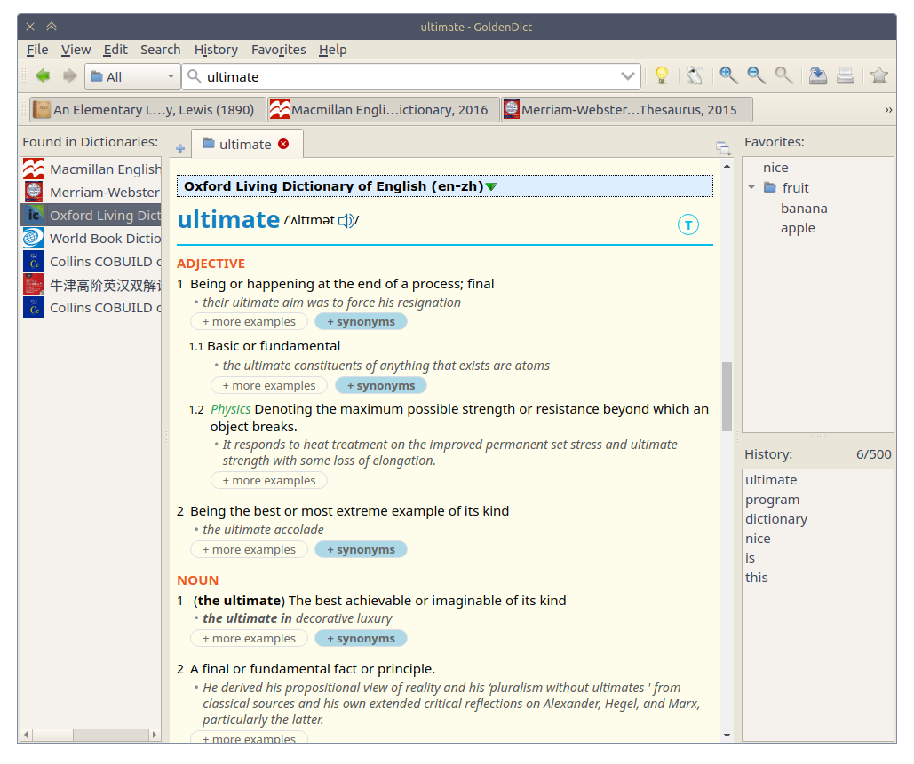
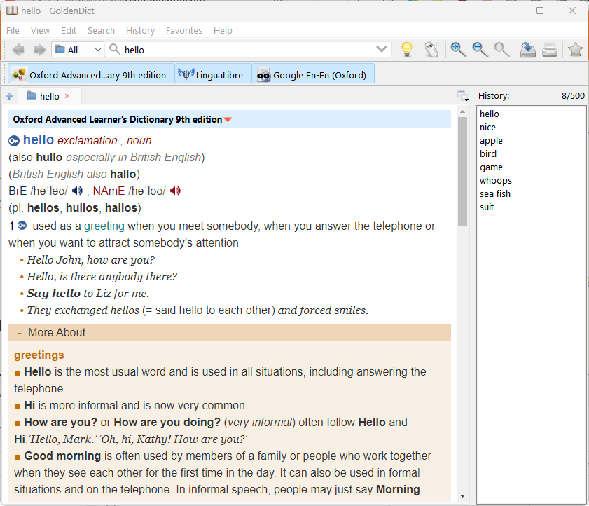

# GoldenDict-ng

[](https://app.codacy.com/gh/xiaoyifang/goldendict?utm_source=github.com&utm_medium=referral&utm_content=xiaoyifang/goldendict&utm_campaign=Badge_Grade_Settings)
[](https://github.com/xiaoyifang/goldendict/actions/workflows/windows.yml) [](https://github.com/xiaoyifang/goldendict/actions/workflows/ubuntu.yml)
[](https://github.com/xiaoyifang/goldendict/actions/workflows/macos.yml)

The Next Generation GoldenDict. A feature-rich open-source dictionary lookup program,
supporting [multiple dictionary formats](https://xiaoyifang.github.io/goldendict-ng/dictformats/) and online
dictionaries.

| Linux | Windows | macOS |
|--|--|--|
| [](website/docs/img/linux_genshin.webp) | [](website/docs/img/windows_white.webp) | [](website/docs/img/mac_black.webp) |

# Some significant features of this fork

- webengine with latest html/css feature support
- support >4GB dictionary
- support highdpi screen resolution
- built with xapian(optional) as fulltext engine
- support Qt5.15.2 and higher ,include latest Qt6
- performance optimization(eg. >10000000 headwords support) 
- anki integration
- dark theme
- daily auto release support
- lots of bug fixes and improvements

## Installation

### Downloads

* [Latest stable version](https://github.com/xiaoyifang/goldendict/releases/latest)
* [Daily pre-release builds](https://github.com/xiaoyifang/goldendict/releases).

Both Qt5 and Qt6 builds are provided.

## Windows

Choose either

* `****-installer.exe ` for traditional installer experience
* `****.zip` for simply unzip and run experience

If Qt's version is not changed, you can also download a single `goldendict.exe` and drop it into previous installation's folder.

## Linux

* `.Appimage` can be used in any recent linux distros.
* [Debian packages](https://tracker.debian.org/pkg/goldendict-webengine) are available in Debian 12 or later.
* [Ubuntu packages](https://launchpad.net/ubuntu/+source/goldendict-webengine) are available in Ubuntu 23.04 or later.
* Archlinux can use [goldendict-ng-git](https://aur.archlinux.org/packages/goldendict-ng-git). Built binary is also availiable from [archlinuxcn's repo](https://github.com/archlinuxcn/repo/tree/master/archlinuxcn/goldendict-ng-git).
* [Gentoo package from PG_Overlay](https://gitlab.com/Perfect_Gentleman/PG_Overlay/-/blob/master/app-text/goldendict/goldendict-9999-r6.ebuild)
* openSUSE ships an old version of this fork.

> Help wanted to package this GoldenDict for linux distros.

## macOS

One of the `.dmg` installers.

## Help GoldenDict's Development

GoldenDict is developed by volunteers.

All kinds of help like answering questions, bug reporting, testing, translation and coding are welcomed.

To translate the interface, you can use the Crowdin <https://crowdin.com/project/goldendict-ng>

To start development, check out [developer guide](https://xiaoyifang.github.io/goldendict-ng/developer/)

## Build from source

### Dependencies

* C++17 compiler
* Qt 5.15 or latest QT version 6.X
* Various libraries on Linux, see below
* On Mac and Windows all the libraries are included in the repository
* Qt Creator is recommended for development

Steps below are using qt5, and you may use qt6 by replacing `5` with `6`.

#### Ubuntu

```
sudo apt-get install git pkg-config build-essential qt5-qmake \
        libvorbis-dev zlib1g-dev libhunspell-dev x11proto-record-dev \
        libxtst-dev liblzo2-dev libbz2-dev \
        libavutil-dev libavformat-dev libeb16-dev \
        libqt5svg5-dev libqt5x11extras5-dev qttools5-dev \
        qttools5-dev-tools qtmultimedia5-dev libqt5multimedia5-plugins libqt5webchannel5-dev qtwebengine5-dev \
        libqt5texttospeech5-dev
```

#### Fedora 35

```
sudo dnf install git pkg-config libzstd-devel opencc-devel xz-devel xz-lzma-compat\
     libvorbis-devel zlib-devel hunspell-devel lzo-devel bzip2-devel \
     ffmpeg-devel eb-devel qt5-qtx11extras-devel libXtst-devel \
     libxkbcommon-devel qt5-qtbase qt5-qttools qt5-qtsvg-devl qt5-qtwebengine-devel qt5-qtmultimedia-devel
```

### Build steps

Clone this repository:
```
git clone https://github.com/xiaoyifang/goldendict-ng.git
```

#### Linux build

```
cd goldendict-ng && qmake-qt5 && make
```

#### macOS build

```
brew install qt # or use official offline installer
qmake CONFIG+=release CONFIG+=zim_support CONFIG+=chinese_conversion_support QMAKE_APPLE_DEVICE_ARCHS="x86_64 arm64"
make 
make install
```

#### Windows build

the source code has offered precompile x64 windows libs on winlibs/lib/msvc. you can build your own version either.

To build with Visual Studio.
check this [how to build with visual studio](howto/how%20to%20build%20and%20debug%20with%20VS2019.md)

Alternatively, you might want to load `goldendict.pro` file from within Qt Creator.

### Build Configurations

**Notice**: All additional configs for `qmake` that must be combined in one  of pass config options to `qmake`:
```
qmake-qt5 "CONFIG+=release" "CONFIG+=zim_support" "CONFIG+=chinese_conversion_support"
```

To ensure the changes applied, you may want to use `make clean` before `make`.

#### Building with Chinese conversion support

To add Chinese conversion support you need at first install libopencc-dev package, then pass `"CONFIG+=chinese_conversion_support"` to `qmake`.

```
sudo apt-get install libopencc-dev
```

#### Building with Zim dictionaries support

To add Zim and Slob formats support you need at first install lzma-dev and zstd-dev packages, then pass `"CONFIG+=zim_support"` to `qmake`

```
sudo apt-get install liblzma-dev libzstd-dev
```

#### Building without Epwing format support

If you have problem building with libeb-dev package, you can pass
`"CONFIG+=no_epwing_support"` to `qmake` in order to disable Epwing format support

#### Building without internal audio players

If you have problem building with FFmpeg (for example, very old linux distro), you can pass
`"CONFIG+=no_ffmpeg_player"` to `qmake` in order to disable FFmpeg internal audio player back end.

If you have problem building with Qt5 Multimedia or experience GStreamer run-time errors (for example, Ubuntu 14.04), you can pass
`"CONFIG+=no_qtmultimedia_player"` to `qmake` in order to disable Qt Multimedia internal audio player back end.

#### Building with xapian

build xapian from source, download and extract the xapian-core source code.

```
./configure
make 
make install
```

 On Windows,follow the instructions in the xapian-core/INSTALL Visual Studio parts.（**xapian does not support to use the  Debug lib in Windows. have to debug in release version mode using xapian's release lib**）.
A precompiled version of xapian lib has provided in winlibs

use `CONFIG+=use_xapian` to enable this feature. when enabled ,xapian will be used to support as the the fulltext's backend engine.

```
qmake "CONFIG+=use_xapian"
```

use `CONFIG+=use_iconv` to enable this feature. when enabled ,iconv will be used to convert encoding other than the QTextCodec(which will be deprecated in future Qt version)

```
qmake "CONFIG+=use_iconv"
```

when enabled ,iconv should be installed on the platform at the same time.

## Support

Bug reporting: [GoldenDict issue tracker](https://github.com/xiaoyifang/goldendict-ng/issues)

General discussions: [discussions](https://github.com/xiaoyifang/goldendict-ng/discussions)

## License

This project is licensed under the <b>GNU GPLv3+</b> license, a copy of which can be found in the `LICENSE.txt` file.

## History

The original project was developed at <http://goldendict.org/> and <https://github.com/goldendict/goldendict>.

