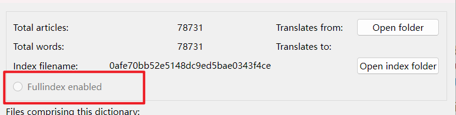

You can customize the dictionary by the metadata.toml which is also used in [metadata grouping](manage_groups.md)

## About the configuration of metadata.toml


the metadata.toml use toml format for configuration.

## Customize the name of the dictionary

```toml
[metadata]
name = "New Name"
```

this `New Name` will be appeared as the dictionary name.


The `metadata.toml` should be placed beside dictionary files. One `metadata.toml` for each dictionary.

The metadata file uses [TOML](https://toml.io) format.


For example,

```
.
├── Cambridge
│    ├── metadata.toml     (A)
│    ├── Cambridge.idx
│    ├── Cambridge.info
│    ├── Cambridge.syn
│    └── Cambridge.dict.dz    
└── Collins
     ├── metadata.toml
     ├── res.zip
     └── Collins.dsl       (B)  

```

## Disable full-text search for certain dictionary

```toml
fts=false

[metadata]
name="New Name"

```

this `fts` field's value can be on/off, 1/0 ,true/false etc.

```
fts=false
```
will disable the current dictionary's full-text search.


you can check the full-text search on each dictionary's info dialog.

