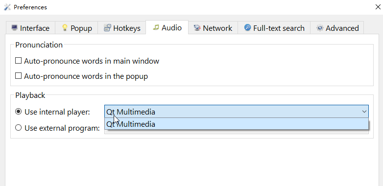

# FAQ

## Where is the ffmpeg audio player[Windows]?

On Linux, it still hold the ffmpeg audio player options(This option can be enabled by `-DWITH_FFMPEG_PLAYER=ON`). 

On Windows, it is disabled by default.

Why?

From Qt6.5+, Qt has used ffmpeg as default implementation of [QMultimedia](<https://doc.qt.io/qt-6/qtmultimedia-index.html#the-ffmpeg-backend>). So, the ffmpeg audio player option is not needed.

If you still want to use ffmpeg audio player, you can configure the external program [Configure](<https://xiaoyifang.github.io/goldendict-ng/ui_audioengine/>)