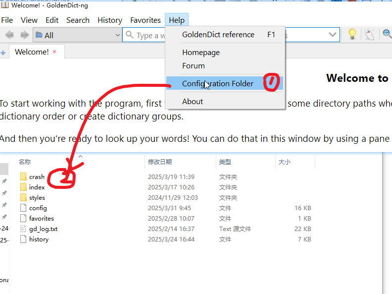

## Bugs Reporting

Report any bugs and dysfunctions to [issues](<https://github.com/xiaoyifang/goldendict/issues>)

If a certain dictionary leads to problems, you **must** attach the dict files or provide download links in bug reports.

Attach your version info from the menu "About" --> "Copy version info".

## Windows Tips

Gather crash dump and log files when reporting bugs.

### Crash Dump

If GD-ng crashes, upload the `.dmp` file in the `crash` folder, which is in the configuration folder.

{ width="450" }

### Runtime Log File

To obtain the runtime log, enable Preferences --> Advanced --> "Save debug messages to gd_log.txt in the config folder".

A `gd_log.txt` will be generated in the configuration folder in the next time you uses GD-ng.

Alternatively, start GD-ng with command line flag `--log-to-file`.

## macOS Tips

macOS has a built-in crash reporter. Copy all the info from the bug report window.

Try to start GD-ng from the command line and save the logs. Alternatively, enable the option of saving log to file as in Windows Tips.

## Linux Tips

If you have no clue, search and learn how to obtain coredumps using tools provided by your distro, and/or learn how to use a debugger. Now is the time.

Noticeably, in recent years, popular distros support new technologies such as `systemd-coredump` and [Debuginfod](https://sourceware.org/elfutils/Debuginfod.html). Traditional approaches include installing debug packages or building from source.

At least, you should start the program in the terminal and upload the log.

