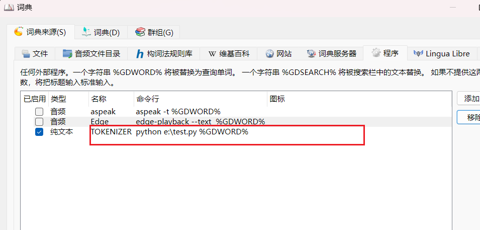

# How to add a program or script to the goldendict-ng

GoldenDict has offered a program dictionary function that allow you to customize the user experience when using the this software.

# An example

tokenize the input german sentence into words.

## use python script 

You can use any script language or program to implement this feature.


## install python

## install SoMaJo

you can follow the instructions in the documentation https://github.com/tsproisl/SoMaJo?tab=readme-ov-file#installation

`pip install -U SoMaJo`

## create a script 

```
from somajo import SoMaJo
import sys

tokenizer = SoMaJo("de_CMC", split_camel_case=True)

# note that paragraphs are allowed to contain newlines
paragraphs = [sys.argv[1]]
sentences = tokenizer.tokenize_text(paragraphs)
for sentence in sentences:
    for token in sentence:
        if token.token_class=='regular':
            print(f"{token.text}")
```

and save the script in the E:\test.py for example.

## add the script to the program dictionary 


`python e:\test.py %GDWORD%`

## the result


