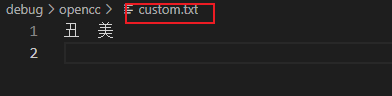
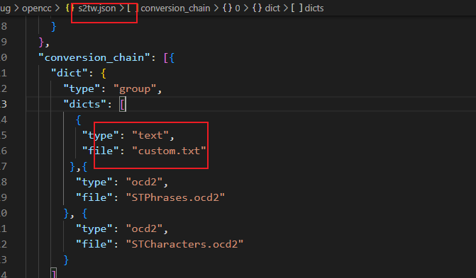

Under the opencc folder, these are the opencc configuration files.

the following three files are currently used in GoldenDict.
```
s2tw.json
s2hk.json
t2s.json
```
- How to specify other configuration files?

1. Create a custom file, such as custom.txt:
   
2. Modify the \*.json file, add the new custom.txt to the configuration:
   
3. Search `丑` in GoldenDict-ng will also show the result of `美`:

any other valid opencc configuration solutions should also work here.
