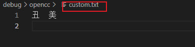
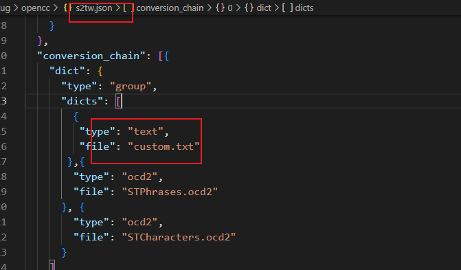

# How to customize OpenCC

Under the `opencc` folder are the OpenCC configuration files.

The [Chinese and Japanese character conversion](../manage_sources.md#chinese-and-japanese-character-conversion) uses the following files:

| File | Conversion |
| ---- | ---------- |
| `s2tw.json` | Simplified Chinese to Traditional Chinese (Taiwan standard) |
| `s2hk.json` | Simplified Chinese to Traditional Chinese (Hong Kong variant) |
| `t2s.json` | Traditional Chinese to Simplified Chinese |
| `s2t.json` | Simplified Chinese to Traditional Chinese, the first step of the Japanese conversion |
| `t2jp.json` | Traditional Chinese (Kyūjitai) to Japanese Shinjitai |
| `jp2t.json` | Japanese Shinjitai to Traditional Chinese (Kyūjitai) |

`jp2t.json` is used as an extra normalization step in front of the Chinese conversions, so Japanese Shinjitai input can also match the Chinese entries. It is applied as a separate conversion chain whose results are merged with the plain one; therefore, it can only add candidates and never replace a plain conversion result.

## How to specify other configuration files?

1. Create a custom file, such as `custom.txt`:

    

2. Modify the `*.json` file and add the new `custom.txt` to the configuration:

    

3. Searching for `丑` in GoldenDict-ng will also show the result of `美`.

Any other valid OpenCC configuration solutions should also work here.
