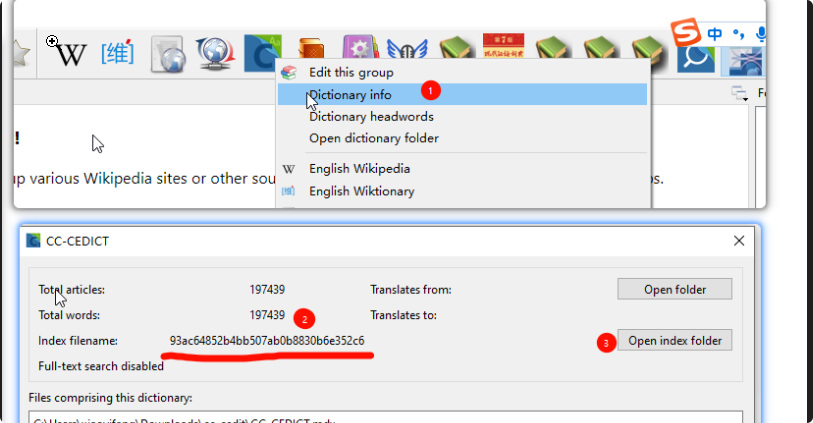
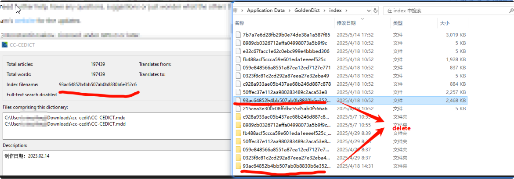

# Purpose

Sometimes you may want to manually reindex the dictionary.

# Steps

1. Find out the dictionaryId of the dictionary

You can find the dictionaryId by right clicking on the dictionary in the dictionary bar.

2. open the index folder

3. exit the gd-ng

4. delete the dictionaryId folder

5. reopen gd-ng

the dictionary will be reindexed.
