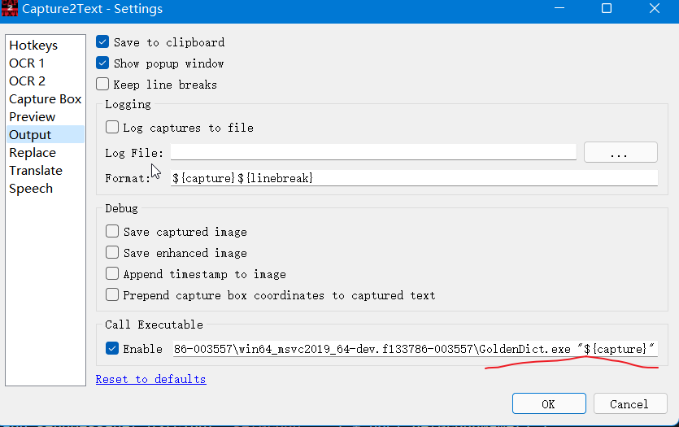
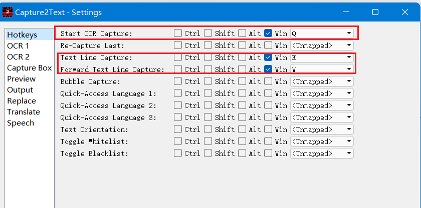
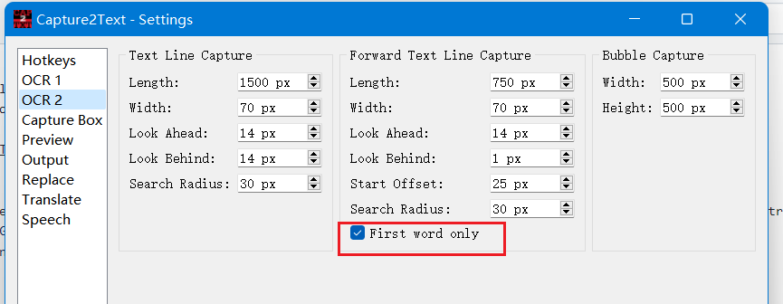
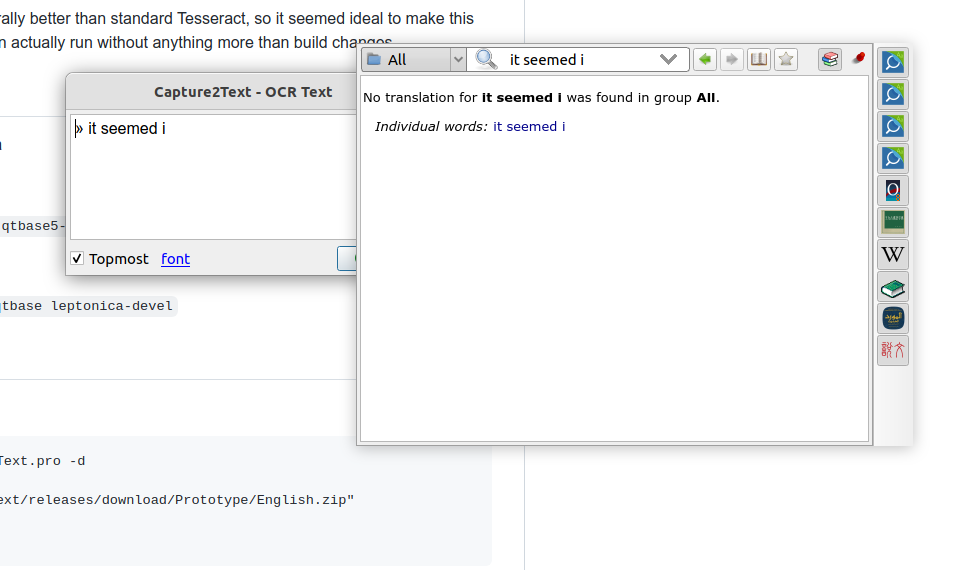
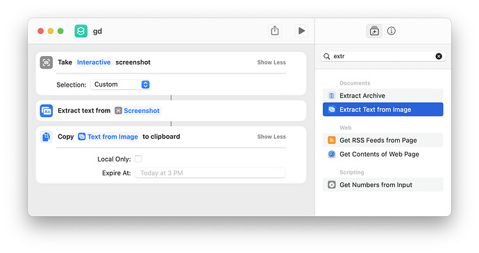
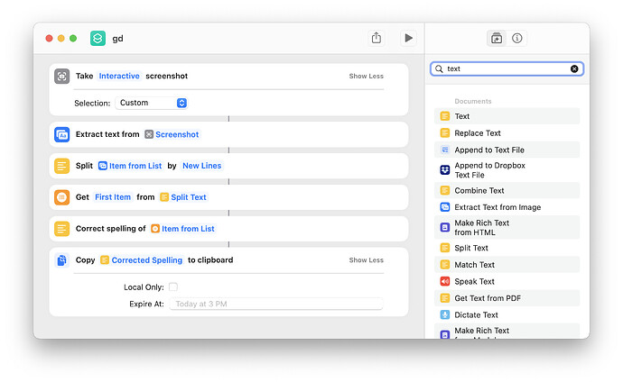

## Current Situation

GoldenDict previously featured word-under-cursor translation on Windows, but that legacy technique is outdated and not cross-platform compatible.

However, any OCR program supporting "post-capture actions" can integrate seamlessly with GoldenDict.

A few examples are provided below, though many similar tools are available.

## Clipboard Monitoring Mode

This is a universal method that works with any OCR program that supports copying recognition results to the clipboard.

### Setup Steps

1. **Enable Clipboard Monitoring in GoldenDict-ng**:

    - **Via Toolbar**: Click the 📋 button on the toolbar to toggle clipboard monitoring on/off
    - **Via Settings**: Open `Edit` → `Preferences`, go to the **Scan Popup** section, enable **Track Clipboard change**, and optionally enable **Start with clipboard monitoring turned on** to auto-enable at startup

2. **Configure Your OCR Program**:

    - Use any OCR software (e.g., Capture2Text, OCRSpace, ScreenTranslate, etc.)
    - Configure the OCR program to copy the recognized text to the system clipboard after recognition

3. **Usage**:

    - Keep GoldenDict-ng running in the background with clipboard monitoring enabled
    - Use your OCR program to capture and recognize text
    - After the OCR program copies the text to clipboard, GoldenDict-ng will automatically detect the change and show the translation popup

### Benefits

- Works with any OCR tool that supports clipboard output
- Cross-platform compatible (Windows, macOS, Linux)
- No need to configure command-line arguments or executable paths
- Simple and flexible integration

## Capture2Text

Capture2Text can call executable after capturing, and you can set the executable to GoldenDict.

Detailed usage document: [Capture2Text](https://capture2text.sourceforge.net/)

[Capture2Text Download](https://github.com/xiaoyifang/Capture2Text/releases/tag/prerelease-20220806)

For example, change the Output action `Call Executable` to `path_to_the_GD_executable\GoldenDict.exe "${capture}"`

Then press <kbd>Win+Q</kbd> and select a region. After capturing a word, Capture2Text will forward the word to GoldenDict. If GoldenDict's Popup is enabled, it will show up.



The hotkeys can be configured:



Capture2Text can also obtain word near the cursor without selecting a region via the "Forward Text Line Capture" by pressing <kdb> Win+W </kbd>

you may want to enable "First word only" so that only a single word would be captured



### Use Capture2Text on Linux

Capture2Text does not have a Linux version, but I have ported it to Linux <https://github.com/xiaoyifang/Capture2Text> thanks to [Capture2Text Linux Port](https://github.com/GSam/Capture2Text ) and
[sikmir](https://github.com/goldendict/goldendict/issues/1445#issuecomment-1022972220).



## Shortcuts.app & Apple's OCR

This is a macOS-specific implementation of the [Clipboard Monitoring Mode](#clipboard-monitoring-mode). Enable clipboard monitoring in GoldenDict-ng (see above), then create a "Shortcut" that will interactively take a screenshot and change the clipboard.



You may also add additional capabilities like only getting the first word



## Tesseract via command line

On Linux, you can combine command line screenshot then pass the output image to Tesseract then pass the text result to `goldendict`

Example with spectacle (KDE) and grim (wayland/wlroots)

```
#!/usr/bin/env bash

set -e

case $DESKTOP_SESSION in
    sway)
        grim -g "$(slurp)" /tmp/tmp.just_random_name.png
    ;;
    plasmawayland | plasma)
        spectacle --region --nonotify --background \
        --output /tmp/tmp.just_random_name.png
    ;;
    *)
        echo "Failed to know desktop type"
        exit 1
    ;;
esac

# note that tesseract will apppend .txt to output file
tesseract /tmp/tmp.just_random_name.png /tmp/tmp.just_random_name --oem 1  -l eng

goldendict "$(cat /tmp/tmp.just_random_name.txt)"

rm /tmp/tmp.just_random_name.png
rm /tmp/tmp.just_random_name.txt
```

### Usage Steps

#### Step 1: Install Required Software (Dependencies)

Depending on your system, you need to install the following tools:

- **OCR Engine**: tesseract and its language packs.
- **Screenshot Tool**: Choose according to your desktop environment:
  - KDE (Plasma): Install spectacle.
  - Sway (Wayland): Install grim and slurp.
- **Other**: bash environment.

Example installation for Ubuntu/Debian:

```bash
sudo apt update
sudo apt install tesseract-ocr tesseract-ocr-eng tesseract-ocr-chi-sim  spectacle
```

> Note: `chi-sim` is the Chinese language pack. The script example only uses English `eng`, but it's recommended to include Chinese as well.

#### Step 2: Create the Script File

Create a new file in your home directory, for example `ocr_translate.sh`:

```bash
nano ~/ocr_translate.sh
```

Copy the code above into it (or type it manually).

Save and exit (In Nano, press `Ctrl+O`, then Enter, then `Ctrl+X`).

#### Step 3: Make It Executable

Run the following command in terminal to make the script executable:

```bash
chmod +x ~/ocr_translate.sh
```

#### Step 4: Use the Script

1. Start GoldenDict first (let it run in the background).
2. Execute the script:

```bash
./ocr_translate.sh
```

**Operation**:

If you're using KDE, your mouse will turn into a crosshair. Drag to select the text region you want to translate.
The script will automatically recognize the text, and GoldenDict will display the word's definition in a popup window.

### 💡 Advanced Optimization Tips

#### Set Up a Keyboard Shortcut

This is the most recommended way to use it. In your system settings -> Shortcuts, add a global shortcut (such as `Ctrl + Alt + G`) pointing to the absolute path of this script (e.g., `/home/your_username/ocr_translate.sh`). This way, whenever you see an unknown word, just press the shortcut to capture it.

#### Support Chinese Recognition

If you need to recognize Chinese, modify the `tesseract` line in the script:

Change `-l eng` to `-l eng+chi_sim` (requires the Chinese language pack to be installed).

#### For GNOME Users

If you're using GNOME desktop, the `case` in the script won't match. You can add a GNOME screenshot command, or use the more generic:

```bash
gnome-screenshot -a -f /tmp/tmp.just_random_name.png
```
