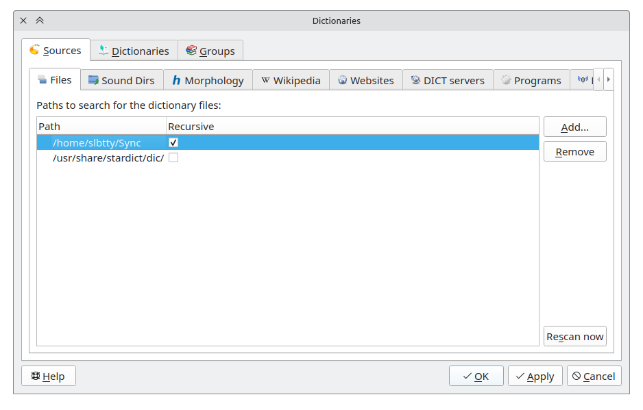

Dictionary management dialog can be opened via menu `Edit` -> `Dictionaries`.

To use local dictionaries, add them via `Sources` -> `Files`.

To inspect or disable individual dictionaries, go `Edit` -> `Dictionaries` -> `Dictionaries`.

If you have too many dictionaries, consider use `Groups` to manage them.

## Files

Here you can add local dictionaries.

Press the "Add" button and select folders that includes your local dictionaries. To search every subfolders, enable the "Recursive".

GoldenDict will scan these folders and add found dictionaries into dictionaries list.

"Rescan" button start forced scan of all folders in list.

## Sound Dirs

Similar to Files, you can either add a folder which contains sound files or a `.zip` archive which contains the sound files.

GD will search through the sound file names when querying words.

## Morphology

A word could have several forms, but sometimes a dictionary only contains one form that could not be found unless you search the normalized form.

Morphology dictionary uses Hunspell's morphological analysis to obtain word's variant forms.

You can specify a path that includes Hunspell format data files (`.aff` + `.dic`). GoldenDict scan this folder and create a list of available dictionaries.

One possible source of Hunspell dictionaries is LibreOffice's [dictionaries](https://github.com/LibreOffice/dictionaries).

The detailed document about the affix file (`.aff`) and the dict file (`.dic`) can be found at [hunspell.5](https://man.archlinux.org/man/hunspell.5.en).

Note that lots of Hunspell's dictionaries are for mostly for spell checking, and they may lack special morphological rules (For example, related words don't share the same stem in `.dic` file).
There are some specially tailored hunspell dicts to use for Morphology. Such as

* <https://sourceforge.net/projects/goldendict/files/better%20morphologies/1.0/>
* <https://github.com/Ajatt-Tools/hunspell-ja>

## Websites

Here you can add any website which allow to set target word in url. To add such site you should set it url with target word template, name for dictionaries list and set mark in "Enabled" column. In the "Icon" column you can set custom icon for this site. If you add icon file name without path GoldenDict will search this file in configuration folder. "As link" column define method of article insertion into common page. If this option is set article will be inserted as link inside `<iframe>` tag (preferable mode). If articles are not loaded in this mode turn this option off, then articles will be inserted as html-code.

Target word can be inserted into url in next encodings::

| Target word template   | Encoding                                |
|------------------------|-----------------------------------------|
| %GDWORD%               | UTF-8                                   |

## DICT servers

Here you can add servers which uses DICT protocol. To add such server you should set its url, name for dictionaries list, server bases list, search strategies list and set mark in "Enabled" column. If bases list is empty GoldenDict will use all server bases. If search strategies list is empty GoldenDict will use "prefix" strategy (comparing the first part of the word).

In the "Icon" column you can set custom icon for every server. If you add icon file name without path GoldenDict will search this file in configuration folder.

## Programs

Here you can add external applications. To add such an application, you should set the command line for its launch, name for the dictionary list and application type.

The `%GDWORD%` in command line will be replaced by word from search line.

| Program type | Purpose                                                                               |
|--------------|---------------------------------------------------------------------------------------|
| Audio        | Play sound.                                                                           |
| Text         | Text printed by the program will be shown as separate article.                        |
| HTML         | HTML printed by the program Will be shown as separate article.                        |
| Prefix match | A list of words printed by the program will be added to search bar's completion list. |

Other than "Audio", the program should print the content to standard output.

In the "Icon" column, you can set a custom icon for every application. If you add icon file name without a path, GoldenDict will search this file in the configuration folder.

!!!note 

    The word will be written to `stdin` in UTF-8 if the command line doesn't contain `%GDWORD%`.

    In rare situations on Windows, some programs may not read `stdin` as UTF-8. In this case, you need to do some adjustments.
    
    For Python3.6+, reading `stdin` as UTF-8 is the default behaviour. For older versions, you may need to change [PYTHONIOENCODING](https://docs.python.org/3/using/cmdline.html#envvar-PYTHONIOENCODING).

    For Node.js, try `process.stdin.setEncoding('utf8');`.

    If you cannot change how your language handles stdin's encoding, try store the data read from the `stdin` as bytes and call related methods that interpret bytes as UTF-8 strings.

    If you cannot access the source code, try enable "Beta: Use Unicode UTF-8 for worldwide language support." in Windows settings.

## Transliteration

Here you can add transliteration algorithms. To add algorithm into dictionaries list just set mark beside it. When such dictionary added into current dictionaries group GoldenDict will search word in the input line as well as result of its handling by corresponding transliteration algorithm.

## System Text-to-speech engines

Its capability is provided via Qt Speech.

On Windows & macOS, the system provides sounds.

On Linux, speech-dispatcher and flite are the backends.