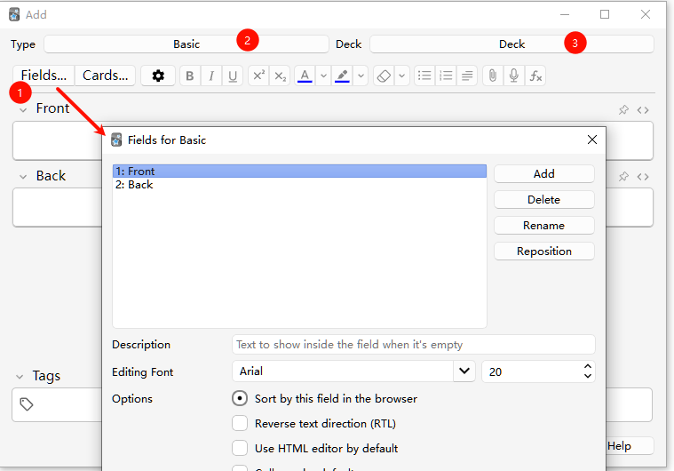
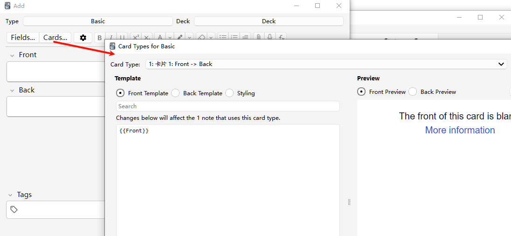
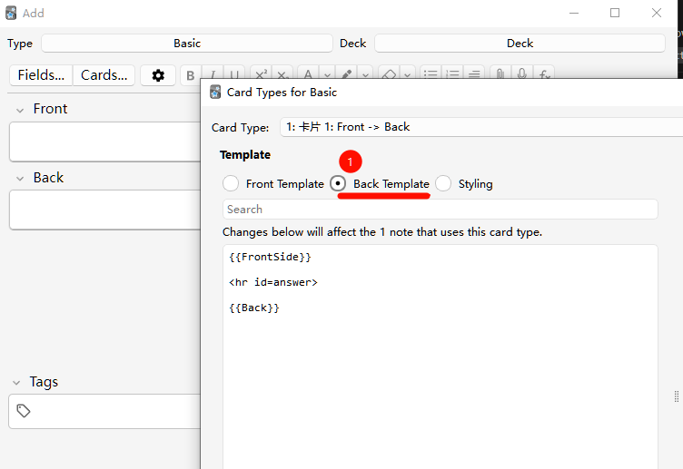
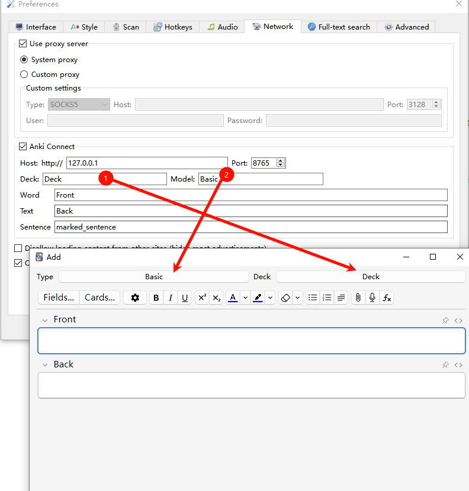

# Anki Integration

## Prerequisites

- Install Anki
- Install AnkiConnect add-on for Anki

## Configure Anki

### Create a new model or use an existing model

For example, the model could have `Front` and `Back` fields.



### Configure the template

#### Front template



#### Back template



## Configure GoldenDict

### Through toolbar → Preferences → Anki tab



#### Field mappings
- **Word**: Vocabulary headword
- **Text**: Selected definition
- **Sentence**: Search string (can be left blank)

#### Example for adding Japanese sentences


### Action


### Result

#### Word and definition


#### Sentence, word, and definition


## Using URI schemes

The `goldendict://word` link can be used to query a word directly in GoldenDict-ng.

On your Anki card's template, you can add the code below to create a "1-click open in GoldenDict-ng" link:

```html
<a href="goldendict://{{Front}}">{{Front}}</a>
```
