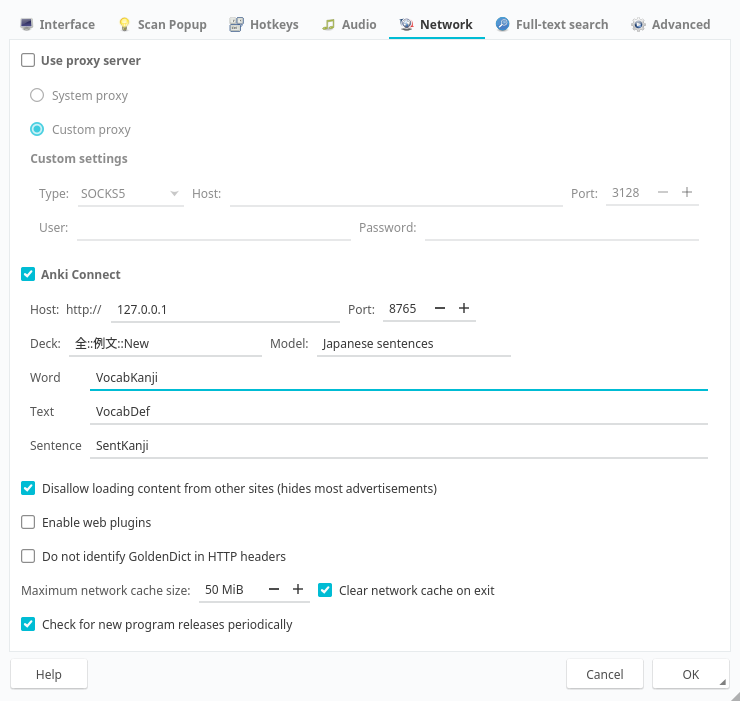
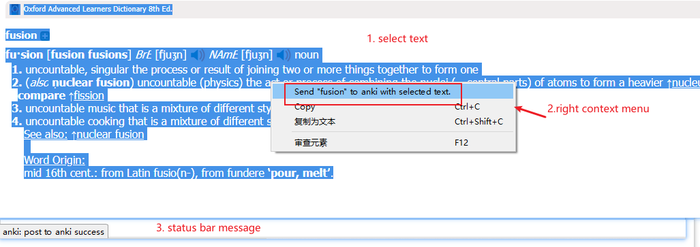
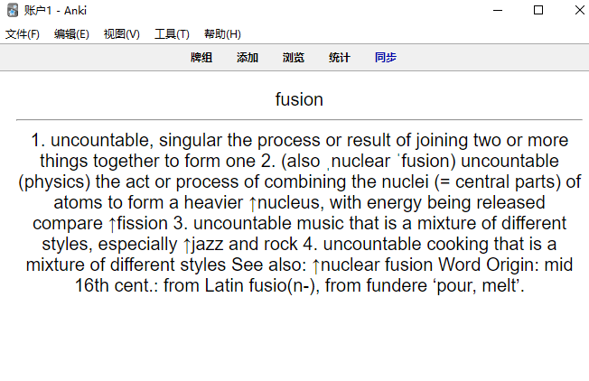
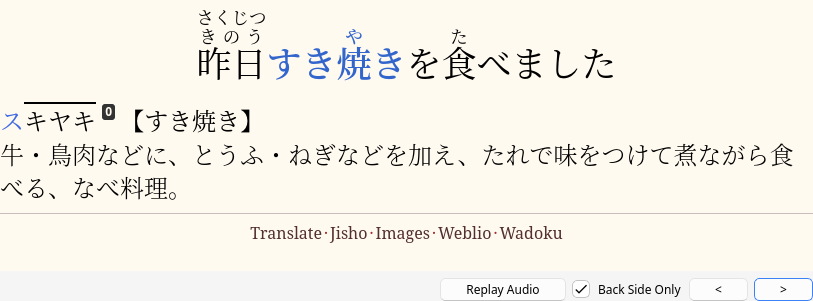

# Anki Integration

## Prerequisites

- Install Anki
- Install AnkiConnect add-on for Anki

## Configure Anki

### Create a new model or use an existing model

For example, the model could have `Front` and `Back` fields.


### Configure the template

#### Front template


#### Back template


## Configure GoldenDict

### Through toolbar → Preferences → Anki tab


#### Field mappings

- **Word**: Vocabulary headword
- **Text**: Selected definition
- **Sentence**: Search string (can be left blank)

#### Example for adding Japanese sentences



### Action



### Result

#### Word and definition



#### Sentence, word, and definition



## Using URI schemes

The `goldendict://word` link can be used to query a word directly in GoldenDict-ng.

On your Anki card's template, you can add the code below to create a "1-click open in GoldenDict-ng" link:

```html
<a href="goldendict://{{Front}}">{{Front}}</a>
```

### Opening in Popup Window（supported specify target parameter at 2026-5-28）

You can specify where to display the translation by adding the `target` parameter:

```html
<!-- Open in popup window -->
<a href="goldendict://{{Front}}?target=popup">{{Front}}</a>

<!-- Open in main window -->
<a href="goldendict://{{Front}}?target=main">{{Front}}</a>
```

**Supported target values:**
- `popup` - Display in scan popup window
- `main` - Display in main window (default if no parameter specified)

**Note for Linux/Wayland users:** The popup window feature may not work properly on some Wayland-based systems due to platform limitations. If you experience issues with `target=popup`, use `target=main` instead or configure GoldenDict to use X11 compatibility mode.

This is useful for quick vocabulary lookup without leaving your current context.
