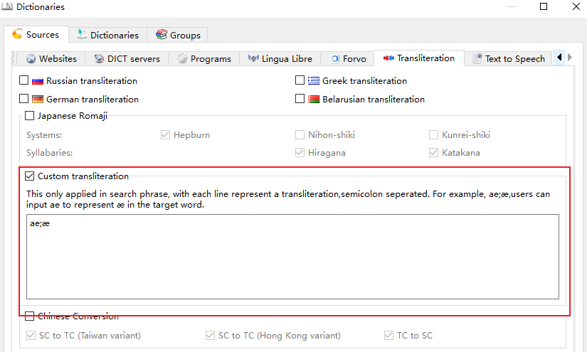
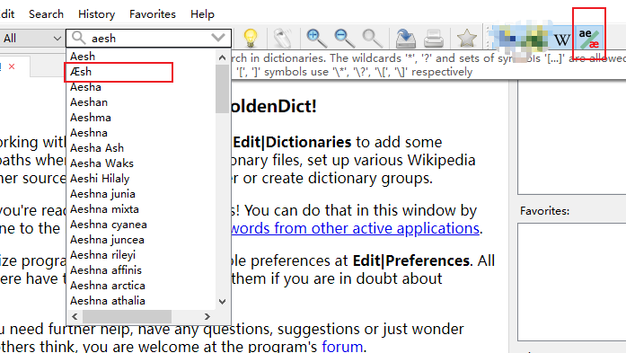

# Transliteration

Transliteration makes a word findable even when it is written in a different script or character variant. It is configured in the `Transliteration` tab of the dictionary sources dialog (`Edit` -> `Dictionaries` -> `Sources`).

When such a dictionary is added to the current dictionaries group, GoldenDict searches for the word in the input line as well as for the result of its handling by the corresponding transliteration algorithm. Every enabled item is registered as a separate dictionary, so it can also be enabled or disabled per dictionary group.

## Built-in transliteration

| Item | Description |
|------|-------------|
| Russian transliteration | Converts a word written with the Latin alphabet into Russian, so a Latin transliteration also matches the Cyrillic entries. |
| German transliteration | Converts the `ae`/`oe`/`ue`/`ss` transcription into the German characters `ä`/`ö`/`ü`/`ß`. |
| Greek transliteration | Converts a word written with the Latin alphabet into Greek. |
| Belarusian transliteration | Converts a word written with the Latin alphabet into Belarusian. |
| Japanese Romaji | Converts Romaji into kana. `Hepburn` is the supported romanization system, while the `Hiragana` and `Katakana` checkboxes select the produced syllabary. |

## Chinese and Japanese character conversion

GoldenDict-ng converts the searched word into the ticked character variants, so the word may be typed in any of these variants and still match the entries:

| Option | Effect |
|--------|--------|
| Simplified (Mainland) | Traditional Chinese and Japanese Shinjitai input is also searched as simplified Chinese. |
| Traditional (Taiwan/Standard) | Simplified Chinese and Japanese Shinjitai input is also searched as traditional Chinese (Taiwan standard). |
| Hong Kong variant | Simplified Chinese and Japanese Shinjitai input is also searched as traditional Chinese (Hong Kong variant). |
| Japanese Shinjitai | Simplified and traditional Chinese input is also searched as Japanese Shinjitai. |

For example, searching `図書館` also finds `圖書館` and `图书馆`.

The conversion data is provided by [OpenCC](https://github.com/BYVoid/OpenCC); see [Customize the opencc](<howto/how to customize the opencc.md>) for the configuration files in use.

## Custom transliteration

This will enable users to configure their own transliteration if the provided transliteration can not meet the requirements.

The rules only apply to the search phrase. Each line defines one transliteration with the input and the target separated by a semicolon, so a line `ae;æ` makes GoldenDict also search `æ` when `ae` is typed.

This is the result after configured `ae;æ `

