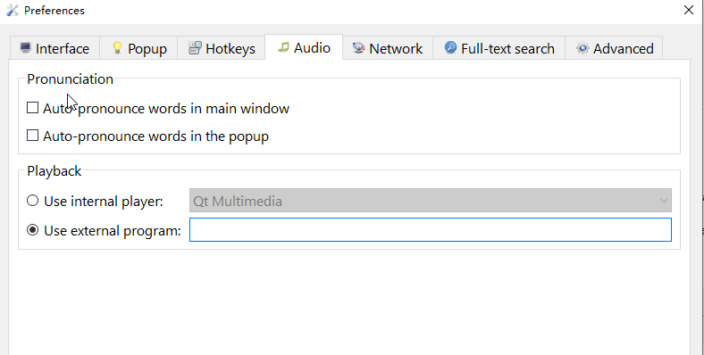

To configure external audio player: Preference --> Audio --> `Use external program`.




vlc:
```
vlc --intf dummy --play-and-exit
```

ffplay:
```
ffplay -autoexit -nodisp
```


mpv:
```
mpv --no-video --no-audio-display
```

or other audio player.
