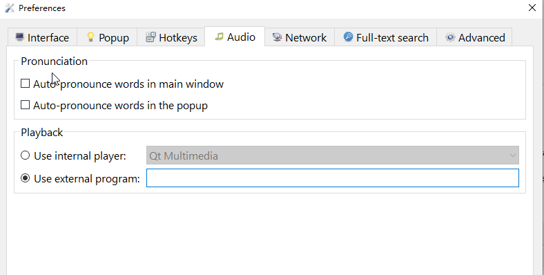

To configure external audio player: Preference --> Audio --> `External Audio Player`.



**Note:** The player command must be either in your system PATH or specified with an absolute path.

**Linux/macOS examples:**

vlc:
```
vlc --intf dummy --play-and-exit --no-video
```

ffplay:
```
ffplay -autoexit -nodisp
```

mpv:
```
mpv --no-video --no-audio-display --no-config
```

**Windows examples (using absolute paths):**

vlc:
```
"C:\Program Files\VideoLAN\VLC\vlc.exe" --intf dummy --play-and-exit --no-video
```

ffplay:
```
"C:\ffmpeg\bin\ffplay.exe" -autoexit -nodisp
```

mpv:
```
"C:\Program Files\mpv\mpv.exe" --no-video --no-audio-display --no-config
```

or other audio player.
