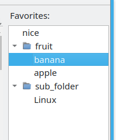

Favorites is a hierarchical structure of folders and headers in them. Folders can be bound to specific groups of dictionaries. The folder is bound to the group if it is specified in the settings of the corresponding group. The headwords opened in that group will be stored to this folder. Accordingly headwords from this folder will be opened in that group. If the folder is not bound to any group of dictionaries then headwords from it will be opened in the current group.

Favorites allows you to create folders manually via context menu, to move/add items to them simply by dragging and dropping as well as to delete selected items via context menu or by pressing the "Del" key.

In addition to adding and removing items to/from the Favorites you can perform the following operations via context menu or the main menu:

* "Export" - the Favorites contents will be exported to the specified XML file while preserving the entire structure.
* "Export to plain list" - all headwords stored in the Favorites will be saved to the specified text file as plain list without saving the folder structure.* * "Import" - the current contents of the Favorites will be replaced by the contents of the specified XML file.