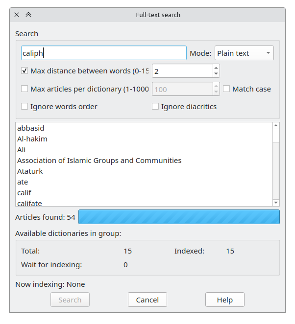

The full-text search dialog can be opened via menu "Search" or "Ctrl+Shift+F".

Full-text search allow to search words or sentences not in dictionary headwords but in articles text of dictionaries from current dictionaries group.

!!! note
    The dictionary will index for full-text search in background and started immediately after program start, name of the currently indexing dictionary is displayed in the status line. This process can take a long time and require many computing resources.You may turn off indexing for huge dictionaries like Wikipedias or Wiktionaries in preferences. To find dictionary which can't be indexed check GoldenDict with `--log-to-file` or check `stdout`.

{ width="450" }

Type the desired word in "Search line" to search.

Search modes

* "Whole words" - for every word contains more then 4 characters in search line the exact match will be found. The "Max distance between words" element define the maximum unmatched words number between matched words. It is the fastest search mode. The search line must contain at least one word from 4 or more characters.
* "Plain text" - mode like "Whole words" but every word in search line can be treated as word fragment.
* "Wildcards" - the search line contains a Unix-like template. Such template can contain wildcard symbols `?` (matches any one character), `*` (matches any characters number) or ranges of characters `[...]` To find characters `?`, `*`, `[` and `]` it should be escaped by backslash like `\?`, `\*`, `\[`, `\]`.
* "RegExp" - the search line contains a regular expression.

"Max articles per dictionary" - the search in dictionary will be stopped when this articles number is found in that dictionary.

"Match case" - if this option is turned on the matches search will be completed in the case-sensitive mode, otherwise in case-insensitive mode.

"Ignore words order" - if this option is enabled, the words specified in the search string will be searched in any order in dictionaries. Otherwise ones will be searched in the order stated in the search string.

"Ignore diacritics" - if this option is enabled, the diacritic symbols will be searched as its base ones.

"Available dictionaries in group" - here you can view how many dictionaries in current group are suitable for full-text search, how many dictionaries already indexed and how many dictionaries wait for indexing.

When you place mouse cursor over headword in results list the tooltip with dictionaries list contains such articles matched the search conditions will be shown.