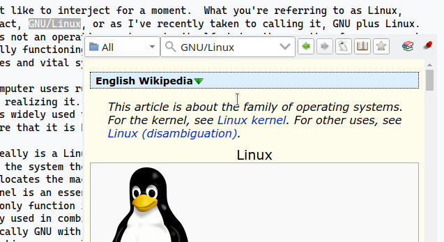

Popup window is a mini window can be used for rapid translation.

Enable it by click the 💡 (enable scanning) on the toolbar or using the context menu of tray icon.

When copying text (clipboard changed), the popup will be displayed near your cursor. 

### Linux

On linux/X11, the text selection can also trigger popup window. You have to enable it in preferences.

### Notes

The popup will also be shown if it is enabled and you use command line `goldendict <word>`.

## Using Popup in conjunction with other applications

!!! note "Help wanted to expand this section"

### capture2text

TODO

### AutoHotKey?

TODO

### macOS applescript? hammerspoon?

TODO

### kde/gnome command shortcuts?

TODO